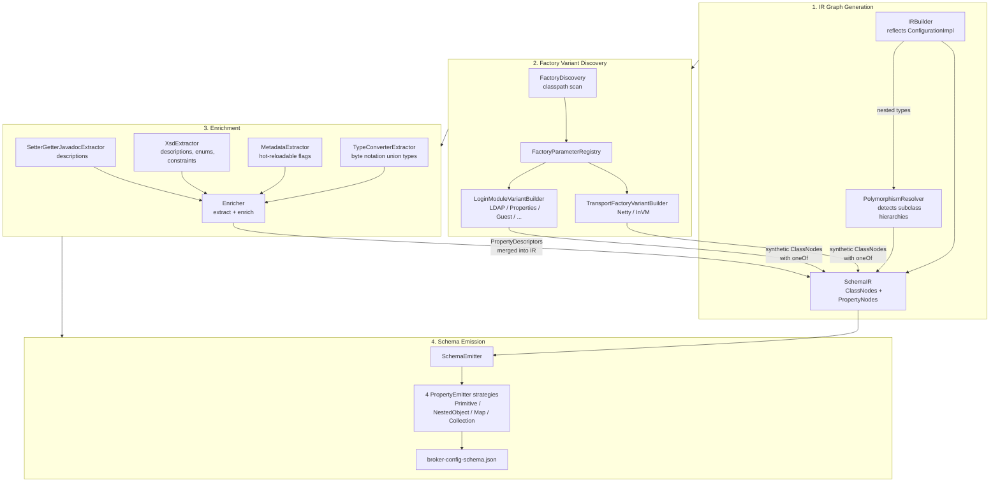

# Artemis JSON Schema Generator

Generates JSON Schema (Draft 7) for Apache Artemis broker configuration validation.

## Quick Start

```bash
# Generate schema (requires artemis-server to be built first)
cd artemis-jsonschema
mvn process-classes -Pgenerate-schema -Dgenerate-schema -DskipTests

# Output at:
# target/schema/org.apache.artemis/jsonschema/broker-config-schema.json
```

## Architecture



The pipeline is strictly linear: **IR -> Factories -> Enrichment -> Emission**.
No cycles, no post-emission patching.

### Pipeline Phases

| Phase | Component | Input | Output |
|-------|-----------|-------|--------|
| 1 | `IRBuilder` | `ConfigurationImpl.class` | `SchemaIR` graph |
| 2 | `FactoryVariantBuilder.createAll()` | Classpath + IR | Synthetic factory variant ClassNodes |
| 3 | `Enricher` with 4 `Extractor` implementations | Source files, XSD | Enriched IR |
| 4 | `SchemaEmitter` + 4 `PropertyEmitter` strategies | Enriched IR | JSON Schema |

### Enrichment Extractors

| Extractor | Parses | Contributes |
|-----------|--------|-------------|
| `SetterGetterJavadocExtractor` | Configuration interface JavaDoc | Descriptions for top-level properties |
| `XsdExtractor` | `artemis-configuration.xsd` | Descriptions, enums, min/max constraints |
| `MetadataExtractor` | `ConfigurationImpl` source | Hot-reload whitelist (`x-hot-reloadable`) |
| `TypeConverterExtractor` | `ConfigurationImpl` converter registrations | Union types `["integer", "string"]` for byte-notation fields, `x-converter`, `pattern` |

### Factory Variant Builders

Artemis uses a map-of-strings pattern for plugin extensibility: a configuration class
holds a discriminator field selecting the implementation, and an opaque `Map<String, Object> params`
whose valid keys depend on which implementation is selected. There is no
`NettyAcceptorFactoryConfiguration.class` with typed bean properties for `host`, `port`,
`sslEnabled` -- those are convention-based string keys discovered from `*_PROP_NAME` constants
and `ConfigKey` enums.

The variant builders create synthetic `$defs` that reconstruct the type information from
convention rather than from the type system.

| Builder | Target Class | Discriminator | Params |
|---------|-------------|---------------|--------|
| `TransportFactoryVariantBuilder` | `TransportConfiguration` | `factoryClassName` | host, port, ssl... |
| `LoginModuleVariantBuilder` | `JaasAppConfigurationEntry` | `loginModuleClass` | user, role, connectionUrl... |

Each variant uses `oneOf` with `required` on the discriminator and `const` + `default` for identity.

### Package Structure

```
jsonschema/
  Pipeline.java            -- orchestrator, the only top-level class
  config/                  -- SchemaGeneratorConfig
  enrichment/              -- Enricher, Extractor interface, 4 extractors
  factories/               -- FactoryDiscovery, FactoryParameterRegistry, FactoryVariantBuilder + 2 subclasses
  ir/                      -- SchemaIR, IRBuilder, SchemaEmitter, SchemaType, PropertyDescriptor, PropertyMetadata, ...
  emitters/                -- PropertyEmitter + 4 strategies (Primitive, NestedObject, Map, Collection)
  annotation/              -- @ConfigProperty, @Heuristic
  validation/              -- SchemaValidator
```

### Type System

`SchemaType` is a value type wrapping `List<SchemaType.Kind>` where `Kind` is an enum
(`STRING`, `INTEGER`, `NUMBER`, `BOOLEAN`, `OBJECT`, `ARRAY`). Single-element for simple
types, multi-element for unions like `["integer", "string"]` (byte-notation fields).
Emitted as a bare string or list depending on cardinality. All type assignments in the
codebase go through `SchemaType.Kind` -- the compiler enforces valid types.

## Design Decisions

### No default values in the schema

Default values are NOT extracted from code. There are three layers of defaults in Artemis
(Java field initializers, XML parser overrides, `artemis create` template values) and no
single source of truth that code inspection can capture. Defaults should be obtained by
running `artemis create` + `artemis properties` against a real broker instance.

The only exceptions are `factoryClassName` / `loginModuleClass` on factory variants, where
the default matches the `const` discriminator -- that's identity, not a runtime default.

### XSD does not contribute types

The XSD declares types for XML configuration (`xsd:string` for fields accepting byte notation
like `"10M"`). But broker.properties uses Java types -- `int` fields only accept integers,
`long` fields accept byte notation through a registered converter. The reflection type is
the truth for broker.properties; the XSD type is the truth for XML configs. The schema
generator targets broker.properties, so reflection wins.

### Factory discriminator as required + const + default

Factory variant `$defs` set `required: ["factoryClassName"]` (or `loginModuleClass`) so that
JSON Schema `oneOf` correctly discriminates between variants. Without `required`, a JSON
that omits the discriminator matches all variants. The `default` matches the `const` to
document the expected value.

## Configuration

`src/main/resources/META-INF/schema-generator-config.json`:

- `factoryInterfaces`: interfaces scanned for implementations (AcceptorFactory, ConnectorFactory, LoginModule)
- `factoryScanPackages`: classpath packages scanned by Reflections
- `ignoredProperties`: property names excluded from IR traversal (avoid circular references)
- `xsdComplexTypeToPathPattern`: maps XSD complexType names to broker.properties path prefixes

## Extension Guide

### Adding a new broker configuration property

Nothing to do. Reflection auto-discovers it from `ConfigurationImpl`.

### Adding documentation for a property

Option A (recommended): Add JavaDoc to the setter or getter in the Configuration class.

Option B (explicit): Add `@ConfigProperty(description = "...")` to the method.

### Adding a new factory-polymorphic type

1. Create a new `FactoryVariantBuilder` subclass in the `factories` package
2. Define `getTargetClassName()`, `getDiscriminatorField()`, `getParamsField()`, `filterFactories()`
3. Add it to `FactoryVariantBuilder.createAll()`

### Adding a new enrichment source

1. Create a class implementing `Extractor`
2. Implement `extract(Path artemisRoot)` returning `List<PropertyDescriptor>`
3. Add it to the extractor list in `Pipeline.run()`

## Testing

```bash
# All tests (unit + integration)
mvn test -pl artemis-jsonschema

# Unit tests only
mvn test -pl artemis-jsonschema -Dtest='!*IntegrationTest'
```

## License

Apache License 2.0 -- See LICENSE file in repository root.
