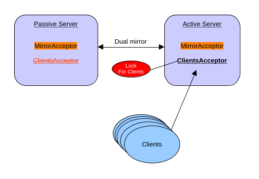

= Lock Coordination / HA with Mirroring
:idprefix:
:idseparator: -
:docinfo: shared

The Lock Coordinator provides pluggable distributed lock mechanism monitoring.
It allows multiple broker instances to coordinate the activation of specific configuration elements, ensuring that only one broker instance activates a particular element at any given time.
This prevents split-brain scenarios where multiple brokers could simultaneously process messages, leading to duplicate processing or conflicting state.

In the current version, the Lock Coordinator can be applied to control the startup and shutdown of:

* *Acceptors* - When an acceptor is associated with a lock coordinator, it will only start accepting connections when the broker successfully acquires the distributed lock. If the lock is lost for any reason, the acceptor automatically stops accepting new connections.

* *Broker Connections* - When a broker connection (AMQP mirror, federation, or bridge) is associated with a lock coordinator, it will only be active when the broker successfully acquires the distributed lock. If the lock is lost, the connection is paused, preventing message flow. When the lock is reacquired, the connection resumes automatically.

The same pattern used on acceptors and broker connections may eventually be applied to other configuration elements.
If you have ideas for additional use cases where this pattern could be applied, please file a JIRA issue.

WARNING: This feature is in technical preview and its configuration elements are subject to possible modifications.

== Configuration

You can define multiple lock-coordinators and associate them with broker elements such as acceptors and broker connections.
When a broker element is associated with a lock-coordinator, it will only activate when the distributed lock has been acquired.
If the lock cannot be acquired or is lost, the elements are automatically stopped or paused.

Different lock implementations (File-based, ZooKeeper-based, or custom plugins) provide different configuration properties.
See the <<Configuration Options>> section below for detailed tables of available options for each lock implementation.

=== Configuration Example

The following example demonstrates a star topology HA configuration where only one broker is active at a time:

* Two acceptors:
  - `for-mirroring-only` - Always active to receive mirrored data from other brokers
  - `for-clients-only` - Controlled by lock-coordinator; only active when lock is held
* File-based lock-coordinator named `clients-lock` using shared storage
* Broker connections controlled by the lock-coordinator (mirrors, bridges, or federations):
  - Two mirror connections (`mirrorB` and `mirrorC`) for data replication
  - One bridge connection for forwarding messages to a remote broker

[,xml]
----
<acceptors>
   <acceptor name="for-mirroring-only">tcp://0.0.0.0:61001?tcpSendBufferSize=1048576;tcpReceiveBufferSize=1048576;protocols=CORE,AMQP,STOMP,HORNETQ,MQTT,OPENWIRE;useEpoll=true;amqpCredits=1000;amqpLowCredits=300</acceptor>
   <acceptor name="for-clients-only" lock-coordinator="clients-lock">tcp://0.0.0.0:61616?tcpSendBufferSize=1048576;tcpReceiveBufferSize=1048576;protocols=CORE,AMQP,STOMP,HORNETQ,MQTT,OPENWIRE;useEpoll=true;amqpCredits=1000;amqpLowCredits=300</acceptor>
</acceptors>

<lock-coordinators>
   <lock-coordinator name="clients-lock">
      <class-name>org.apache.activemq.artemis.lockmanager.file.FileBasedLockManager</class-name>
      <lock-id>mirror-cluster-clients</lock-id>
      <check-period>1000</check-period> <!-- how often to check if the lock is still valid, in milliseconds -->

      <properties>
         <property key="locks-folder" value="/usr/somewhere/existing-folder"/>
      </properties>
   </lock-coordinator>
</lock-coordinators>

<broker-connections>
   <amqp-connection uri="tcp://otherBroker:61001" name="mirrorB" retry-interval="2000" lock-coordinator="clients-lock">
      <mirror sync="false"/>
   </amqp-connection>
   <amqp-connection uri="tcp://otherBroker:61002" name="mirrorC" retry-interval="2000" lock-coordinator="clients-lock">
      <mirror sync="false"/>
   </amqp-connection>
   <amqp-connection uri="tcp://remoteBroker:61616" name="bridgeConnection" retry-interval="2000" lock-coordinator="clients-lock">
      <bridge>
         <bridge-to-queue name="orders" remote-address="orders">
            <include queue-match="orders" address-match="orders"/>
         </bridge-to-queue>
      </bridge>
   </amqp-connection>
</broker-connections>

----

==== How It Works

When a broker successfully acquires the distributed lock:

* The client acceptor (`for-clients-only`) starts accepting connections
* Mirror connections activate and begin replicating data to other brokers
* Bridge connections activate and forward messages to remote brokers
* Federation connections activate (if configured)

When the lock is lost (due to failure or network partition):

* The client acceptor stops accepting new connections
* All broker connections (mirrors, bridges, and federations) pause immediately
* The broker continues to receive mirrored data on the `for-mirroring-only` acceptor

This ensures only one broker actively processes client requests, replicates data, and forwards messages at any given time.

==== Important Considerations

WARNING: When mixing bridges or federations with mirrors in the same configuration, message duplication is possible during failover transitions. When a message arrives at a mirror target and that node's broker connections are active, the message may be forwarded even though it was already processed by the original source. Lock coordination significantly reduces this risk but cannot completely eliminate it during the brief window when locks are being transferred between brokers.

You can find a https://github.com/apache/artemis-examples/tree/main/examples/features/broker-connection/ha-with-mirroring[working example] on how to run HA with Mirroring.

== Configuration Options

All lock-coordinator implementations share common configuration elements and provide implementation-specific properties.

=== Common Configuration

The following elements are configured on every lock-coordinator regardless of implementation:

[cols="1,1,1,3"]
|===
|Element |Required |Default |Description

|name
|Yes
|None
|Unique identifier for this lock-coordinator instance, used to reference it from other configuration elements

|class-name
|Yes
|None
|The lock provider implementation (e.g., `org.apache.activemq.artemis.lockmanager.file.FileBasedLockManager` or `org.apache.activemq.artemis.lockmanager.zookeeper.CuratorDistributedLockManager`)

|lock-id
|Yes
|None
|Unique identifier for the distributed lock. All brokers competing for the same distributed lock must use the same lock-id

|check-period
|No
|5000
|How often to check if the lock is still valid, in milliseconds
|===

=== File-Based Lock Manager

The file-based lock manager uses the file system to manage distributed locks through file locking mechanisms.
All brokers must have access to a shared file system location.

**Class name:** `org.apache.activemq.artemis.lockmanager.file.FileBasedLockManager`

**Properties:**

[cols="1,1,1,3"]
|===
|Property |Required |Default |Description

|locks-folder
|Yes
|None
|Path to the directory where lock files will be created and managed. The directory must be created in advance before using this lock.
|===

=== ZooKeeper-Based Lock Manager

The ZooKeeper-based lock manager uses Apache Curator to manage distributed locks via a ZooKeeper ensemble.
This is the recommended approach for production deployments as it provides better fault tolerance and doesn't require shared storage.

**Class name:** `org.apache.activemq.artemis.lockmanager.zookeeper.CuratorDistributedLockManager`

**Properties:**

[cols="1,1,1,3"]
|===
|Property |Required |Default |Description

|connect-string
|Yes
|None
|ZooKeeper connection string (e.g., "localhost:2181" or "host1:2181,host2:2181,host3:2181")

|namespace
|Yes
|None
|Namespace prefix for all ZooKeeper paths to isolate data

|session-ms
|No
|18000
|Session timeout in milliseconds

|session-percent
|No
|33
|Percentage of session timeout to use for lock operations

|connection-ms
|No
|8000
|Connection timeout in milliseconds

|retries
|No
|1
|Number of retry attempts for failed operations

|retries-ms
|No
|1000
|Delay in milliseconds between retry attempts
|===
